```mermaid
graph TD
    A[Cheminformatics] --> B[1. Representation]
    A --> C[2. Descriptors]
    A --> D[3. Similarity & Clustering]
    A --> E[4. Machine Learning]
    A --> F[5. Applications]
    A --> G[6. Tools & Data]

    B --> B1[SMILES/InChI]
    B --> B2[Molecular Graphs]
    B --> B3[3D Conformers]

    C --> C1[Physicochemical]
    C --> C2[Fingerprints]
    C --> C3[Substructures]

    D --> D1[Similarity Metrics]
    D --> D2[Dim. Reduction]
    D --> D3[Clustering]

    E --> E1[QSAR/QSPR]
    E --> E2[ML Algorithms]
    E --> E3[GNNs]
    E --> E4[Model Evaluation]

    F --> F1[Drug Discovery]
    F --> F2[Toxicity Prediction]
    F --> F3[Patent Mining]
    F --> F4[Virtual Screening]

    G --> G1[RDKit / OpenBabel]
    G --> G2[PubChem / ChEMBL]
    G --> G3[File Formats]
```

Dưới đây là **cây khái niệm (concept tree)** toàn diện nhập môn **Cheminformatics**, được tổ chức theo 5 trục chính: Representation → Descriptor → Similarity → Modeling → Application.

---

## 🧠 **Cây Khái Niệm Cheminformatics – Dạng Markdown**

```markdown
# 🌳 Concept Tree – Cheminformatics

## 1. Molecular Representation (Biểu diễn phân tử)
- SMILES / InChI
  - Canonical SMILES
  - Stereochemistry
- Molecular Graphs
  - Atoms = nodes
  - Bonds = edges
- 3D Conformer & Coordinates
  - Geometry optimization (e.g., RDKit + UFF/MMFF)
- Aromaticity, Valence Rules
- Isomerism (Structural vs Stereoisomers)

## 2. Molecular Descriptors & Fingerprints
- Physicochemical Descriptors
  - MW, LogP, H-bond donors/acceptors
  - TPSA, rotatable bonds
- Fingerprints (Bitvector)
  - MACCS keys
  - Morgan (ECFP), FCFP
  - Atom pairs / Topological torsions
- Substructure Features
  - Functional groups
  - Scaffold / Murcko scaffold
  - Maximum common subgraph (MCS)

## 3. Similarity & Clustering
- Similarity Metrics
  - Tanimoto coefficient (Jaccard)
  - Dice, Cosine, Euclidean
- Molecular Distance
  - Feature vector-based
  - Graph-based kernel distance
- Dimensionality Reduction
  - PCA / t-SNE / UMAP
- Clustering
  - K-means, DBSCAN, Hierarchical
- Diversity Analysis

## 4. Machine Learning & Predictive Modeling
- QSAR / QSPR Modeling
  - Regression, Classification
  - Dataset splitting (train/val/test)
- ML Algorithms
  - Random Forest, SVM, XGBoost
  - Neural Network, DeepChem
- Graph Neural Networks (GNN)
  - Message Passing Neural Network (MPNN)
  - DGL, PyTorch Geometric, Chemprop
- Model Evaluation
  - ROC-AUC, Precision-Recall
  - Cross-validation, Y-Randomization

## 5. Applications of Cheminformatics
- Drug Discovery
  - Hit/lead identification
  - ADMET prediction
- Virtual Screening
  - Similarity-based
  - Docking-based
- Toxicity Prediction
- Patent Mining & Novelty Detection
- Chemical Space Exploration
- Bioisosterism & Scaffold Hopping

## 6. Tools & Datasets
- Libraries
  - RDKit, Open Babel, DeepChem
- Databases
  - PubChem, ChEMBL, ZINC
- Descriptor Generators
  - Mordred, PaDEL, CDK

## 7. Standards & File Formats
- Chemical identifiers
  - SMILES, InChI, IUPAC name
- File formats
  - SDF, MOL, PDB, XYZ, CSV
```

---

## 🧩 **Sơ đồ cây khái niệm – Dạng đồ họa (Mermaid)**



---

Nếu bạn muốn mình:

* Tạo file `.pdf`, `.png`, hoặc `.drawio` từ sơ đồ trên
* Chuyển thành định dạng dùng được cho app như Obsidian, Notion, hay Mindmap Pro
* Tổ chức thành lộ trình học, mapping tài liệu cho từng nhánh

thì cứ bảo nhé. Mình có thể convert và tối ưu tiếp.
