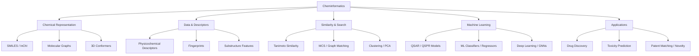

Tuyệt vời! Để nhập môn **cheminformatics** (tin học hóa học) một cách **bài bản và có hệ thống**, bạn nên tiếp cận qua 3 trục chính:

---

## 🧭 **1. Tổng quan kiến thức nền cần có**

| Chủ đề              | Vai trò trong cheminformatics         |
| ------------------- | ------------------------------------- |
| 📚 Hóa học hữu cơ   | Hiểu cấu trúc, phản ứng, nhóm chức    |
| 🧮 Toán & xác suất  | Mô hình hóa, vector, similarity       |
| 🧠 Machine learning | Phân loại, dự đoán hoạt tính, QSAR    |
| 🔬 Bioinformatics   | Nếu hướng đến drug discovery          |
| 🧾 SMILES, InChI    | Mã hóa phân tử dưới dạng chuỗi        |
| 🧱 Graph theory     | Phân tử = đồ thị; motif, substructure |

---

## 📘 **2. Các sách kinh điển**

### 🏆 **Sách nền tảng - Cheminformatics tổng quát**

| Tên sách                                                                                       | Nội dung chính                                            | Ghi chú           |
| ---------------------------------------------------------------------------------------------- | --------------------------------------------------------- | ----------------- |
| **\[1] “An Introduction to Chemoinformatics” – Andrew Leach & Valerie Gillet**                 | Cơ bản nhất: mô tả, biểu diễn, similarity, QSAR, ứng dụng | ⭐ Bắt đầu từ đây  |
| **\[2] “Chemoinformatics: Concepts, Methods, and Tools for Drug Discovery” – Jürgen Bajorath** | Tập trung vào ứng dụng trong dược học                     | Rất thực tế       |
| **\[3] “Handbook of Chemoinformatics” – Gasteiger & Engel (4 tập)**                            | Toàn diện, từ lý thuyết đến ứng dụng                      | Thư viện lớn dùng |

---

### 📊 **Sách bổ trợ ML & Graphs**

| Tên sách                                              | Nội dung                                                    |
| ----------------------------------------------------- | ----------------------------------------------------------- |
| “Deep Learning for the Life Sciences” – O'Reilly      | ML + Bio + Chem – dùng DL để dự đoán hóa chất, protein, ... |
| “Machine Learning in Chemistry” – Hugh M. Cartwright  | ML cổ điển (SVM, RF) trong hóa học                          |
| “Graph Representation Learning” – William L. Hamilton | Học đồ thị, áp dụng vào phân tử                             |

---

## 🎓 **3. Các khóa học nhập môn**

### 📺 **MOOC & Online Course**

| Nguồn                                   | Tên khóa                                                                                                                   | Ghi chú                                               |
| --------------------------------------- | -------------------------------------------------------------------------------------------------------------------------- | ----------------------------------------------------- |
| 📘 **Coursera – University of Basel**   | \[“Chemoinformatics” ([https://www.coursera.org/learn/chemoinformatics](https://www.coursera.org/learn/chemoinformatics))] | Khóa chất lượng, giáo trình rõ, từ SMILES đến mô hình |
| 🧪 **eChemInfo (European hub)**         | [https://www.echemportal.org](https://www.echemportal.org)                                                                 | Rất nhiều tài liệu & link đến học liệu mở             |
| 💻 **ChEMBL Tutorials**                 | [https://chembl.gitbook.io/chembl-interface-documentation/](https://chembl.gitbook.io/chembl-interface-documentation/)     | Hướng dẫn dùng Cơ sở dữ liệu ChEMBL – rất quan trọng  |
| 📚 **NIH’s PubChem Bioassay tutorials** | [https://pubchemdocs.ncbi.nlm.nih.gov/](https://pubchemdocs.ncbi.nlm.nih.gov/)                                             | Hướng dẫn sử dụng dữ liệu bio/chem miễn phí           |

---

## 🧪 **4. Tools & thư viện nên học**

| Tool                                              | Dùng để làm gì                                   |
| ------------------------------------------------- | ------------------------------------------------ |
| 🧬 **RDKit**                                      | Biểu diễn phân tử, tính descriptor, dựng mô hình |
| 🧪 **Open Babel**                                 | Chuyển đổi định dạng hóa học                     |
| 🔍 **PubChem, ChEMBL, ZINC**                      | Trích xuất compound data để training             |
| 🤖 **scikit-learn / XGBoost / PyTorch Geometric** | Học máy & graph learning                         |

---

## 🧭 **5. Lộ trình gợi ý cho bạn**

```markdown
1. 📘 Đọc “An Introduction to Chemoinformatics” từ Leach & Gillet → song song học SMILES + RDKit
2. 🎓 Làm khóa “Chemoinformatics” trên Coursera
3. 🧪 Tự phân tích data từ ChEMBL / PubChem (predict activity, clustering, ...)
4. 🧠 Học tiếp ML / DL / GNN áp dụng vào phân tử (sách Hamilton + tutorial từ DeepChem)
5. 🧬 Triển khai mô hình đầu tiên: fingerprint + ML → lên dần QSAR/Docking
```

---

Nếu bạn cần mình **gợi ý tài nguyên theo hướng học academic (kiểu để viết paper) hay thực chiến (áp dụng vào industrial discovery, patent, registry)** thì có thể nói rõ nhé. Mình có thể gợi ý thêm hướng đi chi tiết hơn theo nhu cầu cụ thể.

--------------------

Rất tốt – bạn đang đi theo hướng **xây cây khái niệm (concept tree)** để thiết lập tư duy hệ thống cho lĩnh vực **cheminformatics**. Để làm được điều đó, cần:

> **(1) Sách/course có hệ thống lý thuyết bài bản**
> **(2) Tài liệu tổ chức theo chiều *conceptual map*, không chỉ tutorial rời rạc**
> **(3) Hướng dẫn cách mapping kiến thức nền → kỹ thuật → ứng dụng**

---

## ✅ **Gợi ý tốt nhất để xây dựng cây khái niệm từ đầu**

| Loại                       | Nguồn                                                                                                                                     | Ghi chú                                                                                 |
| -------------------------- | ----------------------------------------------------------------------------------------------------------------------------------------- | --------------------------------------------------------------------------------------- |
| 📘 **Sách chuẩn**          | `An Introduction to Chemoinformatics` – Leach & Gillet                                                                                    | **Tốt nhất để dựng cây khái niệm từ gốc**, có cả sơ đồ kiến thức                        |
| 📘                         | `Chemoinformatics: A Textbook` – Gasteiger & Engel (Springer)                                                                             | Tập trung vào *foundational concepts* và **mô hình hóa biểu diễn phân tử**              |
| 🎓 **Course học thuật**    | [Coursera – Chemoinformatics](https://www.coursera.org/learn/chemoinformatics) (Univ. of Basel)                                           | Có video + slide + bài tập từ căn bản đến phức tạp                                      |
| 📗 **Sổ tay trực quan**    | `Handbook of Chemoinformatics Algorithms` – Faulon & Bender                                                                               | Nếu muốn cây khái niệm + thực thi thuật toán cụ thể (similarity, fingerprints, QSAR...) |
| 🌐 **Ontology chính thức** | [https://bioportal.bioontology.org/ontologies/CHMO](https://bioportal.bioontology.org/ontologies/CHMO) (CHMO – Chemical Methods Ontology) | Dùng để **tra khái niệm, xây ontology chuẩn**                                           |

---

## 🌳 **Khung cây khái niệm (concept tree) bạn có thể xây như sau**



---

## 🧩 **Các khái niệm cốt lõi (gợi ý để bạn học)**

| Mảng         | Concept cần nắm                                            |
| ------------ | ---------------------------------------------------------- |
| Biểu diễn    | SMILES, InChI, Graph-based, Canonicalization               |
| Descriptor   | MACCS, Morgan/ECFP fingerprint, Mordred, RDKit descriptors |
| Similarity   | Tanimoto, Euclidean, Cosine, Graph kernels                 |
| Substructure | MCS (Maximum Common Subgraph), Scaffold, Functional Groups |
| ML/Modeling  | QSAR, QSPR, XGBoost, SVM, GNN (Message Passing NN)         |
| Thực hành    | Dùng RDKit, DeepChem, OpenBabel, PubChem, ChEMBL           |

---

## 🎓 **Lộ trình học cụ thể để xây “concept map”**

| Giai đoạn                                 | Nguồn học                                           | Mục tiêu                                                         |
| ----------------------------------------- | --------------------------------------------------- | ---------------------------------------------------------------- |
| 1️⃣ **Nhập môn tổng quan**                | `Leach & Gillet book` (chương 1–5) + Coursera Basel | Biết được các thành phần chính của lĩnh vực, sơ đồ hóa kiến thức |
| 2️⃣ **Xây dựng biểu diễn & descriptor**   | RDKit + chương 6–8 của Leach                        | Biết phân tử được mã hóa, vector hóa như thế nào                 |
| 3️⃣ **Tính toán similarity & clustering** | scikit-learn + chương 9–10                          | Hiểu khái niệm distance, clustering, tìm compound gần nhau       |
| 4️⃣ **Học máy cho QSAR**                  | Cartwright ML book + DeepChem tutorials             | Dự đoán hoạt tính phân tử                                        |
| 5️⃣ **Ứng dụng & refinement**             | Case study từ sách Gasteiger hoặc DeepChem          | Mapping lại cây concept + phát hiện lỗ hổng kiến thức            |

---

## 🧠 Nếu bạn muốn mình:

* **Dựng sơ đồ tư duy toàn diện** (concept tree, dạng Markdown/Graph)
* **Gợi ý thêm tài liệu chuyên sâu cho từng nhánh**
* **Gợi ý hướng ra đề bài nghiên cứu hoặc industrial use-case**

hãy nói rõ mục tiêu nhé (ví dụ: hướng vào drug discovery, hay patent detection, hay AI cho hóa chất...). Mình có thể giúp bạn refine tiếp từ đây.
